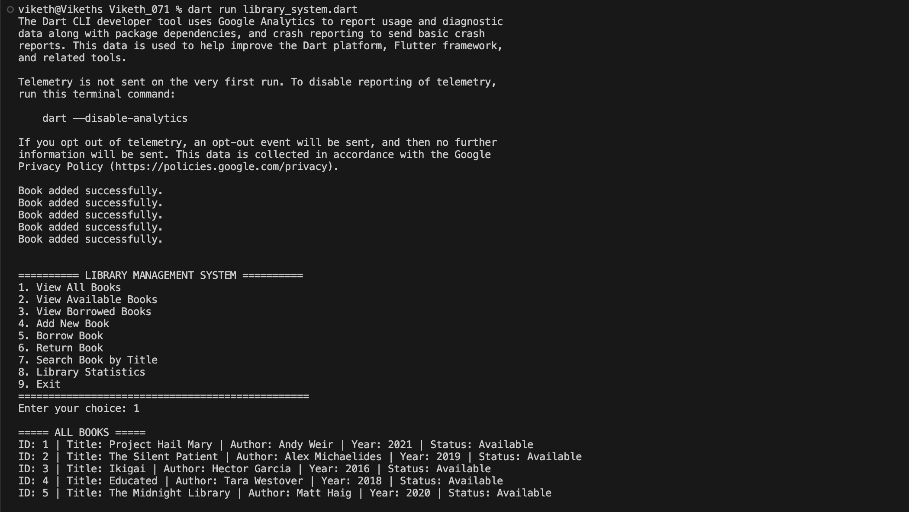
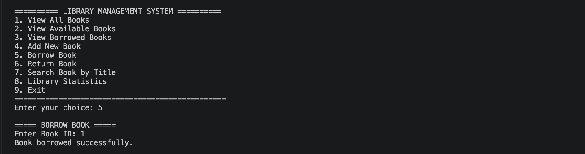
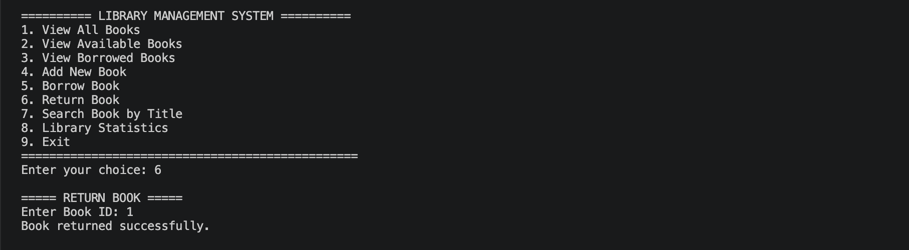
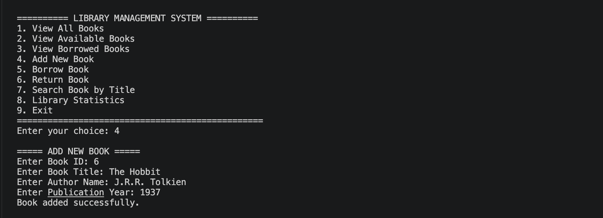
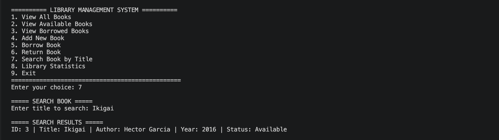
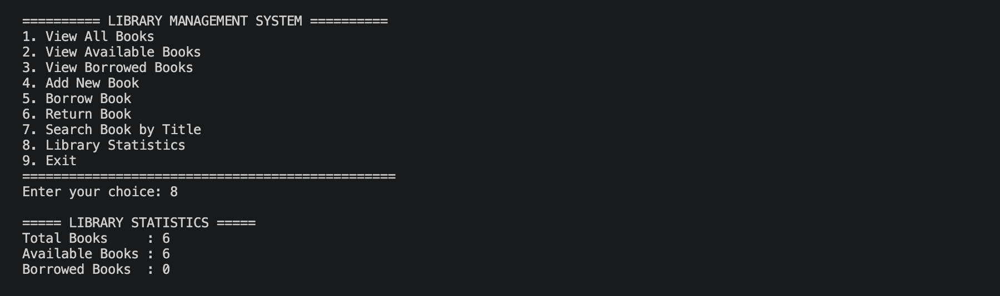

# Library Management System

A console-based Library Management System developed in Dart utilizing Object-Oriented Programming (OOP) principles.

## Project Overview

This application simulates a real-world library system allowing users to manage books through an interactive command-line interface. Users can view books, add new books, borrow and return books, search books by title, and view library statistics.

The project demonstrates core Dart and OOP concepts such as **abstraction**, **inheritance**, **encapsulation**, **polymorphism**, **mixins**, **constructors**, **collections**, **loops**, **conditional statements**, and **robust error handling**.

---

## Features

- 📚 **View All Books**: Display all books present in the library along with their detailed status.
- ✅ **View Available Books**: Filter and display only books that are currently available for borrowing.
- ❌ **View Borrowed Books**: Filter and display only books that have been borrowed.
- ➕ **Add New Book**: Add a new book to the library with ID, title, author, and publication year validation.
- 📖 **Borrow Book**: Borrow a book by entering its ID (prevents borrowing already borrowed books).
- ↩️ **Return Book**: Return a borrowed book by entering its ID (prevents returning available books).
- 🔍 **Search Books by Title**: Case-insensitive partial matching search by title.
- 📊 **Library Statistics**: View total books, available count, borrowed count, and availability percentage.
- 🛡️ **Error Handling**: Gracefully handles non-numeric choices, duplicate IDs, invalid publication years, and non-existent IDs.
- 🚀 **Pre-populated Sample Data**: Starts with 5 curated sample books.

---

## OOP Concepts Demonstrated

### 1. Abstraction
Defined through the `LibraryItem` abstract class, specifying the essential getters and methods (`borrowItem()`, `returnItem()`, `displayInfo()`) without concrete implementations.

```dart
abstract class LibraryItem {
  int get id;
  String get title;
  String get author;
  int get year;

  void borrowItem();
  void returnItem();
  void displayInfo();
}
```

### 2. Interface / Mixin
Used `LoggerMixin` to provide logging capabilities to classes:

```dart
mixin LoggerMixin {
  void logAction(String action) {
    // Audit logging hook
  }
}
```

### 3. Encapsulation
The `Book` class encapsulates data using private fields (`_id`, `_title`, `_author`, `_year`, `_isAvailable`) and controlled access via getters and setters with validation.

```dart
class Book extends LibraryItem with LoggerMixin {
  int _id;
  String _title;
  String _author;
  int _year;
  bool _isAvailable;
  // Getters and setters...
}
```

### 4. Inheritance & Method Overriding
The `Book` class extends `LibraryItem` and overrides all abstract methods and getters:

```dart
@override
void borrowItem() {
  if (_isAvailable) {
    _isAvailable = false;
    print('✅ Book "$_title" (ID: $_id) borrowed successfully.');
  }
}
```

### 5. Polymorphism
Polymorphism is demonstrated through method overriding where operations like `displayInfo()`, `borrowItem()`, and `returnItem()` dynamically perform subclass-specific behavior when invoked through parent references.

### 6. Collections & Encapsulated Lists
The `Library` class manages a private list of books `final List<Book> _books = [];` exposing an unmodifiable view for safety.

---

## Class Structure

```
LibraryItem (Abstract Class)   LoggerMixin (Mixin)
          \                        /
           v                      v
                    Book
                     |
                     v
                  Library
                     |
                     v
                LibraryApp
                     |
                     v
                  main()
```

---

## Application Menu Options

```
==================================================
📚 WELCOME TO THE LIBRARY MANAGEMENT SYSTEM 📚
==================================================
--------------------------------------------------
📋 MAIN MENU
--------------------------------------------------
1. 📚 View All Books
2. ✅ View Available Books
3. ❌ View Borrowed Books
4. ➕ Add a New Book
5. 📖 Borrow a Book
6. ↩️  Return a Book
7. 🔍 Search Books by Title
8. 📊 View Library Statistics
9. 🚪 Exit
--------------------------------------------------
```

---

## Sample Books

The application initializes with 5 default sample books:

| ID | Title | Author | Year | Status |
|---|---|---|---|---|
| 1 | The Alchemist | Paulo Coelho | 1988 | Available |
| 2 | Atomic Habits | James Clear | 2018 | Available |
| 3 | Harry Potter and the Sorcerer's Stone | J.K. Rowling | 1997 | Available |
| 4 | Clean Code | Robert C. Martin | 2008 | Available |
| 5 | Project Hail Mary | Andy Weir | 2021 | Available |

---

## How to Run

### Prerequisites
Make sure Dart SDK is installed on your system.
Verify Dart installation with:
```bash
dart --version
```

### Execution Steps
1. Open terminal in the project directory:
   ```bash
   cd Arohi-073-flutter-assignment03
   ```
2. Run the application:
   ```bash
   dart run library_system.dart
   ```
3. Alternatively, you can copy the code from `library_system.dart` into [DartPad](https://dartpad.dev/) and click **Run**.

---

## Screenshots

### 1. Main Menu


### 2. Borrow Book & View Borrowed Books


### 3. Return Book Successfully


### 4. Add Book Successfully


### 5. Search Books by Title


### 6. View Library Statistics


### 7. Error Handling & Validation


---

## Author

- **Name**: Arohi Chakote
- **Roll No**: 073
- **Degree**: B.Tech Computer Science Engineering
- **Institution**: ITM Skills University (2024–2028)
